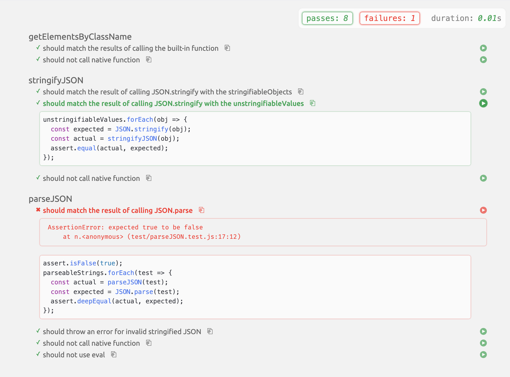
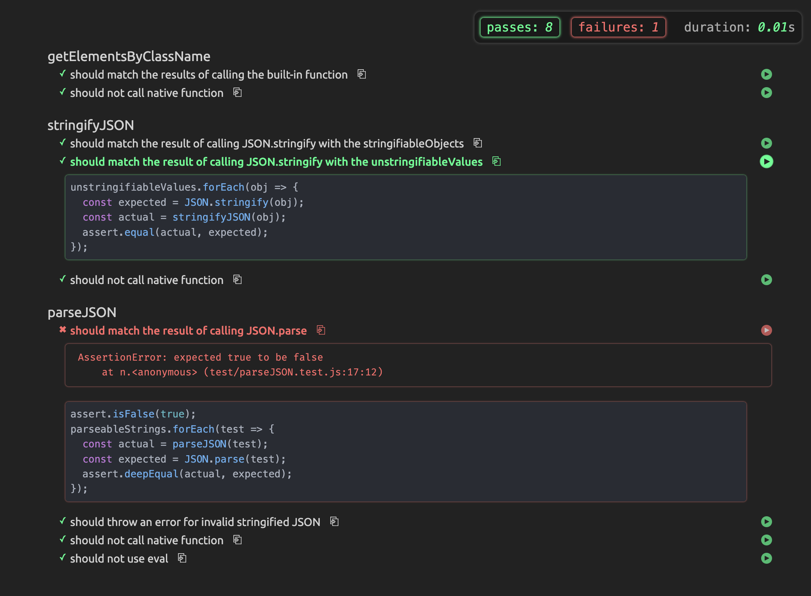

# Custom mocha styles

This is a simple package that includes some additional style/functionality to the mocha test runner.

## Include in your project

To include this package in your project, simply add the following to the `<head>` of your html test file

### Styles

```html
<link
  rel="stylesheet"
  href="https://cdn.jsdelivr.net/gh/OperationSpark/mocha-style@main/mocha.css"
/>
```

### Syntax highlighting

```html
<script src="https://cdn.jsdelivr.net/gh/OperationSpark/mocha-style@main/injectStyles.js"></script>
```

### Example

```html
<!DOCTYPE html>
<html>
  <head>
    ...
    <link
      rel="stylesheet"
      href="https://cdn.jsdelivr.net/gh/OperationSpark/mocha-style@main/mocha.css"
    />

    <script
      src="https://cdn.jsdelivr.net/gh/OperationSpark/mocha-style@main/injectStyles.js"
      defer
    ></script>

    ...
  </head>
  ...
</html>
```

## Preview

### Light Mode



### Dark Mode


